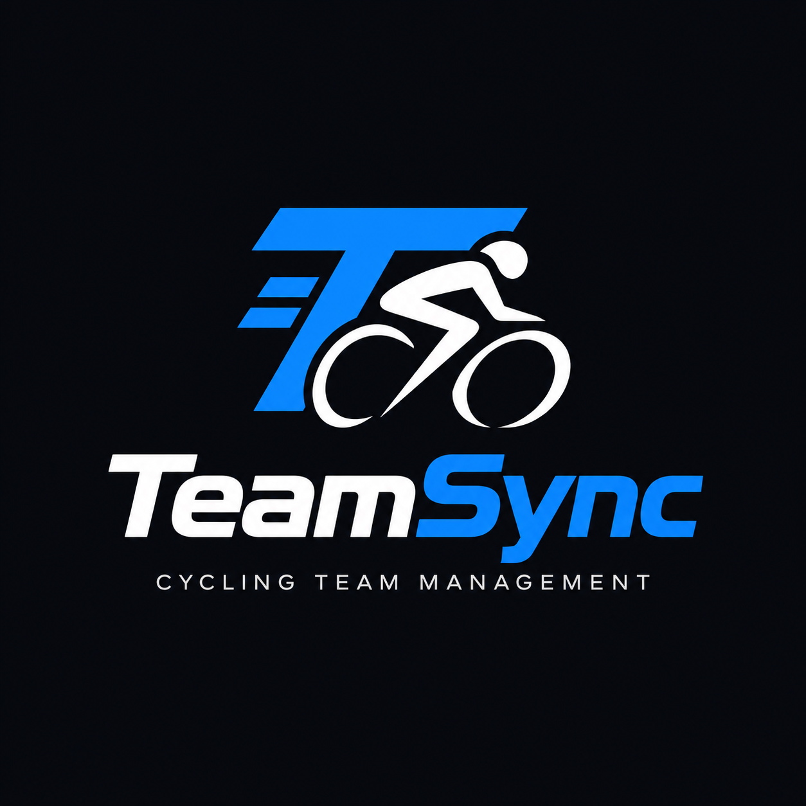

<div align="center">



# TeamSync Backend

A Spring Boot REST API for managing cycling teams, athletes, staff, sponsors, competitions, and results.

[](https://spring.io/projects/spring-boot)
[](https://openjdk.org/)
[](https://www.postgresql.org/)
[](https://jwt.io/)
[](LICENSE)

</div>

---

## Overview

TeamSync is the backend API for a cycling team management platform. It is designed to keep a team's operational data in one place: team profile, managers, athletes, staff members, staff roles, addresses, sponsors, disciplines, competitions, and race results.

The project focuses on a simple but important rule: authenticated users only work with data from their own team. The current authentication flow is manager-based, using Spring Security and JWT tokens. After login, the backend uses the authenticated manager's team to scope team-owned resources such as athletes, staff, sponsors, staff roles, and results.

This repository contains the backend only. The frontend is developed separately at [TeamSync-Frontend](https://github.com/AFaria20s/TeamSync-Frontend).

## Main Features

- **JWT authentication** for manager login and stateless API requests.
- **Team-scoped data access** for the main business resources.
- **Athlete management** with profile, contact, license, nationality, and account data.
- **Staff management** with custom team-specific staff roles.
- **Sponsor management** with contact details, type, status, and contract dates.
- **Competition and result tracking** for cycling events and athlete performance.
- **Discipline catalog** for cycling disciplines used by teams and competitions.
- **PostgreSQL persistence** through Spring Data JPA and Hibernate.
- **Generated OpenAPI documentation** with springdoc-openapi and Swagger UI.

## Tech Stack

| Area | Technology |
| --- | --- |
| Language | Java 21 |
| Framework | Spring Boot 4.1.1 |
| API | Spring Web MVC |
| Security | Spring Security, JWT, BCrypt |
| Persistence | Spring Data JPA, Hibernate |
| Database | PostgreSQL |
| Build tool | Maven Wrapper |
| API docs | springdoc-openapi, Swagger UI |
| Utilities | Lombok, Bean Validation |

## Deployment

The backend is deployed on [Render](https://render.com) using Docker.

**Live API:** https://teamsync-backend-vdtx.onrender.com
**Swagger UI:** https://teamsync-backend-vdtx.onrender.com/swagger-ui/index.html

The database is hosted on [Supabase](https://supabase.com) (PostgreSQL 17).

Environment variables required for deployment:
- `DB_URL` — JDBC connection string
- `DB_USERNAME` — database user
- `DB_PASSWORD` — database password
- `JWT_SECRET` — secret for signing JWT tokens
- `JWT_EXPIRATION` — token expiration in milliseconds

## Project Structure

```text
src/main/java/org/afonso/teamsync
├── controller/      REST endpoints
├── dto/             Request and response payload models
├── entity/          JPA entities mapped to database tables
├── repository/      Spring Data repositories
├── security/        JWT, authentication filter, and security config
└── service/         Business logic and team-scoped operations

src/main/java/org/afonso/exceptions
└── Global exception handling and custom exceptions
```

## Domain Model

TeamSync currently works with these main resources:

| Resource | Purpose |
| --- | --- |
| `Team` | Stores the team profile, including name, acronym, license, phone, location, and description. |
| `Manager` | Authenticated account type used to access the API. Managers belong to a team. |
| `Athlete` | Rider profile with email, password, phone, license, nationality, and team relationship. |
| `Staff` | Team staff member with account information, contact details, address, and staff role. |
| `StaffRole` | Custom role defined by each team, such as coach, mechanic, or physiotherapist. |
| `Sponsor` | Team sponsor profile with contact information, type, status, and contract period. |
| `Address` | Reusable address information for people and sponsors. |
| `Discipline` | Cycling discipline such as road, XCO, XCC, DHI, or time trial. |
| `Competition` | Race or event with name, location, date, and discipline. |
| `Result` | Athlete result in a competition, including position, finish time, points, and DNF state. |

## Authentication

Only `/api/auth/**` is public. Every other endpoint requires a valid JWT token.

Login request:

```http
POST /api/auth/login
Content-Type: application/json
```

```json
{
  "email": "manager@example.com",
  "password": "your-password"
}
```

Successful response:

```json
{
  "token": "eyJhbGciOiJIUzI1NiJ9..."
}
```

Use the token in later requests:

```http
Authorization: Bearer <token>
```

The application currently authenticates managers through `ManagerRepository`. There is no public registration endpoint yet, so an initial team and manager must exist in the database before login.

Account creation is planned and already under development. The intended flow is a public registration endpoint that creates the first `Team` and its first `Manager` together, then returns a JWT so the new manager can start using the platform immediately.

## API Documentation

API documentation is generated at runtime with springdoc-openapi.

After starting the application, open:

```text
http://localhost:8080/swagger-ui.html
```

The raw OpenAPI specification is available at:

```text
http://localhost:8080/v3/api-docs
```

Swagger UI supports JWT-protected endpoints through the `Authorize` button. Login with `/api/auth/login`, then authorize with the returned token before calling protected endpoints.

## Getting Started

### Requirements

- Java 21 or newer
- PostgreSQL 16 or compatible PostgreSQL version
- Git
- Maven is optional because the project includes `mvnw` and `mvnw.cmd`

### 1. Clone the Repository

```bash
git clone https://github.com/AFaria20s/TeamSync-Backend.git
cd TeamSync-Backend
```

### 2. Create the Database

Create a local PostgreSQL database:

```sql
CREATE DATABASE teamsync;
```

### 3. Configure the Application

Copy the example configuration:

```bash
cp src/main/resources/application.properties.example src/main/resources/application.properties
```

Update `src/main/resources/application.properties` with your local database credentials:

```properties
spring.datasource.url=jdbc:postgresql://localhost:5432/teamsync
spring.datasource.username=your_user
spring.datasource.password=your_password
spring.datasource.driver-class-name=org.postgresql.Driver

spring.jpa.hibernate.ddl-auto=validate
spring.jpa.show-sql=true
spring.jpa.properties.hibernate.dialect=org.hibernate.dialect.PostgreSQLDialect
spring.jpa.properties.hibernate.format_sql=true

spring.application.name=teamsync
server.port=8080

springdoc.api-docs.path=/v3/api-docs
springdoc.swagger-ui.path=/swagger-ui.html

jwt.secret=replace-with-a-long-random-secret-of-at-least-32-characters
jwt.expiration=86400000
```

Generate a local JWT secret with:

```bash
openssl rand -base64 64
```

### 4. Prepare the Schema

The application is configured with `spring.jpa.hibernate.ddl-auto=validate`, which means Hibernate expects the database tables to already exist.

For local development, if you do not already have the schema created, you can temporarily use:

```properties
spring.jpa.hibernate.ddl-auto=update
```

Start the app once so Hibernate creates or updates the tables, then switch back to `validate` when you want stricter schema checks.

### 5. Seed an Initial Manager

Login depends on an existing manager record. At minimum, the database needs:

- one `team`
- one `manager` linked to that team
- a BCrypt password hash in `manager.password_hash`

There is currently no public signup endpoint in this backend, so seed the first team and manager directly in the database or with your own SQL seed script.

### 6. Run the API

On Linux or macOS:

```bash
./mvnw spring-boot:run
```

On Windows:

```bash
mvnw.cmd spring-boot:run
```

The API starts on:

```text
http://localhost:8080
```

Swagger UI starts on:

```text
http://localhost:8080/swagger-ui.html
```

### 7. Login and Make a Request

Login:

```bash
curl -X POST http://localhost:8080/api/auth/login \
  -H "Content-Type: application/json" \
  -d '{"email":"manager@example.com","password":"your-password"}'
```

Use the returned token:

```bash
curl http://localhost:8080/api/team \
  -H "Authorization: Bearer <token>"
```

## Development Commands

Run the application:

```bash
./mvnw spring-boot:run
```

Run tests:

```bash
./mvnw test
```

Build the project:

```bash
./mvnw clean package
```

Run the packaged jar:

```bash
java -jar target/teamsync-0.0.1-SNAPSHOT.jar
```

## Security Notes

- Keep `jwt.secret` out of version control.
- Use a strong secret with at least 32 characters.
- Store passwords only as BCrypt hashes.
- Do not trust `teamId` values from request bodies for team-owned data; the backend derives the team from the authenticated manager.
- Keep `ddl-auto=validate` outside local experimentation to avoid accidental schema changes.

## Current Limitations

- Manager registration is not exposed as a public API endpoint yet, but account creation is planned and already under development.
- Role-specific authorization rules are not fine-grained yet; non-auth endpoints are protected, but most access control currently depends on authentication and service-level team scoping.
- Some resources, such as disciplines, competitions, and addresses, are currently global rather than team-scoped.
- The project does not currently include database migration files or seed scripts.

## License

This project is licensed under the MIT License. See [LICENSE](LICENSE) for details.

---

<div align="center">

Built by [AFaria20s](https://github.com/AFaria20s)

</div>
